# 🔀 Connection Methods

Complete guide to RssBot Platform's revolutionary per-service connection autonomy system.

## 🎯 Overview

RssBot Platform introduces **Per-Service Connection Autonomy** - each service independently chooses how to connect and communicate:

- **🔗 Router Mode**: Direct function calls within the same process
- **🌐 REST Mode**: HTTP API calls to independent services  
- **⚡ Hybrid Mode**: Intelligent switching between router and REST
- **🚫 Disabled Mode**: Complete service isolation

This flexibility allows optimal performance tuning for each service's specific requirements.

## 🏗️ Connection Method Architecture

```mermaid
graph TB
    subgraph "🎯 Controller Core"
        CTRL[Controller Engine]
        PROXY[Service Proxy<br/>Smart Router]
        DECISION[Decision Engine<br/>Hybrid Logic]
    end
    
    subgraph "🔗 Router Mode"
        DIRECT[Direct Function Calls]
        SHARED[Shared Memory/Resources]
    end
    
    subgraph "🌐 REST Mode"
        HTTP[HTTP Requests]
        INDEPENDENT[Independent Processes]
    end
    
    subgraph "⚡ Hybrid Mode"
        INTELLIGENT[Intelligent Routing]
        FALLBACK[Automatic Failover]
    end
    
    subgraph "📡 Services"
        SVC1[Service A<br/>Router Mode]
        SVC2[Service B<br/>REST Mode]
        SVC3[Service C<br/>Hybrid Mode]
        SVC4[Service D<br/>Disabled]
    end
    
    CTRL --> PROXY
    PROXY --> DECISION
    
    DECISION --> DIRECT
    DECISION --> HTTP
    DECISION --> INTELLIGENT
    
    DIRECT --> SVC1
    HTTP --> SVC2
    INTELLIGENT --> SVC3
    
    PROXY -.-> SVC4
```



## 🔗 Router Mode (Direct Integration)

### When to Use Router Mode

**Best For:**
- ✅ Core services (database, authentication)
- ✅ High-frequency operations
- ✅ Development and testing
- ✅ Services requiring shared state
- ✅ CPU-intensive operations

**Avoid When:**
- ❌ Services need independent scaling
- ❌ Different programming languages
- ❌ Services have different resource requirements
- ❌ Strong fault isolation needed

### Implementation

```python
# Router mode - direct function calls
class RouterModeProxy:
    def __init__(self):
        # Import service modules directly
        from services.db_svc.main import DatabaseService
        from services.ai_svc.main import AIService
        
        self.db_service = DatabaseService()
        self.ai_service = AIService()
    
    async def call_service(self, service_name: str, method: str, **kwargs):
        """Direct function call - no HTTP overhead"""
        
        service_map = {
            "db_svc": self.db_service,
            "ai_svc": self.ai_service
        }
        
        service = service_map.get(service_name)
        if not service:
            raise ServiceNotAvailableError(service_name)
        
        # Direct method call
        method_func = getattr(service, method)
        return await method_func(**kwargs)

# Example usage
proxy = RouterModeProxy()

# This is a direct function call - no serialization overhead
result = await proxy.call_service(
    "db_svc", 
    "get_feeds", 
    user_id=123, 
    limit=10
)
```

### Router Mode Benefits

```python
# Performance comparison
import time

async def router_mode_call():
    """Direct function call"""
    start_time = time.time()
    
    # Direct call - no HTTP overhead
    result = await db_service.get_feeds(user_id=123)
    
    end_time = time.time()
    return result, (end_time - start_time) * 1000  # ms

# Typical performance: 0.1-2ms
```

**Characteristics:**

| Aspect               | Router Mode                 |
|----------------------------------------------------|
| **Performance**      | ⚡Fastest(0.1-2m)          ‌‌‌‌‌ |
| **Memory Usage**     | 🟢 Shared memory space      |
| **Error Handling**   | 🟢 Direct stack traces      |
| **Type Safety**      | 🟢 Full Python type checking|
| **Scalability**      | 🟡 Process-bound            |
| **Fault Isolation**  | 🔴 Shared failure domain    |
| **Language Support** | 🔴 Python only              |
| **Debugging**        | 🟢 Single process debugging |

## 🌐 REST Mode (HTTP Microservices)

### When to Use REST Mode

**Best For:**
- ✅ Independent service scaling
- ✅ Language-agnostic services
- ✅ Strong fault isolation
- ✅ Distributed deployments
- ✅ Third-party integrations
- ✅ CI/CD independence

**Avoid When:**
- ❌ High-frequency internal calls
- ❌ Real-time performance critical
- ❌ Complex shared state needed
- ❌ Development/testing simplicity required

### Implementation

```python
# REST mode - HTTP API calls
class RESTModeProxy:
    def __init__(self):
        self.client = httpx.AsyncClient()
        self.service_urls = {
            "ai_svc": "http://ai-service:8003",
            "bot_svc": "http://bot-service:8002"
        }
    
    async def call_service(self, service_name: str, method: str, **kwargs):
        """HTTP API call to independent service"""
        
        service_url = self.service_urls.get(service_name)
        if not service_url:
            raise ServiceNotAvailableError(service_name)
        
        # Prepare HTTP request
        url = f"{service_url}/api/{method}"
        headers = {
            "Content-Type": "application/json",
            "Authorization": f"Bearer {self.service_token}",
            "User-Agent": "RssBot-Platform/1.0"
        }
        
        # Make HTTP request
        try:
            response = await self.client.post(
                url, 
                json=kwargs, 
                headers=headers,
                timeout=30.0
            )
            response.raise_for_status()
            return response.json()
            
        except httpx.TimeoutException:
            raise ServiceTimeoutError(service_name)
        except httpx.HTTPStatusError as e:
            raise ServiceAPIError(service_name, e.response.status_code, e.response.text)

# Example usage
proxy = RESTModeProxy()

# This makes an HTTP request to independent service
result = await proxy.call_service(
    "ai_svc",
    "process_content",
    text="Content to process",
    action="summarize"
)
```

### REST Mode Service Example

```python
# Independent AI service running on port 8003
from fastapi import FastAPI
from pydantic import BaseModel

app = FastAPI()

class ProcessRequest(BaseModel):
    text: str
    action: str
    max_length: int = 200

@app.post("/api/process_content")
async def process_content(request: ProcessRequest):
    """Independent AI service endpoint"""
    
    if request.action == "summarize":
        # AI processing logic
        summary = await openai_client.create_completion(
            model="gpt-3.5-turbo",
            messages=[{
                "role": "user",
                "content": f"Summarize this text in {request.max_length} characters: {request.text}"
            }]
        )
        
        return {
            "original_text": request.text,
            "summary": summary.choices[0].message.content,
            "processing_time_ms": 1250
        }
    
    raise HTTPException(400, f"Unknown action: {request.action}")

# Run independently: uvicorn ai_service:app --port 8003
```

**Characteristics:**

| Aspect | REST Mode |
|--------|-----------|
| **Performance** | 🟡 Slower (5-50ms) |
| **Memory Usage** | 🟡 Separate processes |
| **Error Handling** | 🟡 HTTP error codes |
| **Type Safety** | 🟡 API contract validation |
| **Scalability** | 🟢 Unlimited horizontal scaling |
| **Fault Isolation** | 🟢 Complete isolation |
| **Language Support** | 🟢 Any language |
| **Debugging** | 🟡 Distributed tracing needed |

## ⚡ Hybrid Mode (Intelligent Switching)

### When to Use Hybrid Mode

**Best For:**
- ✅ Production environments
- ✅ Variable load patterns
- ✅ Services needing fault tolerance
- ✅ Development to production transition
- ✅ Services with changing requirements

### Intelligent Decision Engine

```python
class HybridModeProxy:
    def __init__(self):
        self.router_proxy = RouterModeProxy()
        self.rest_proxy = RESTModeProxy()
        self.decision_cache = LRUCache(maxsize=100)
    
    async def call_service(self, service_name: str, method: str, **kwargs):
        """Intelligently choose between router and REST"""
        
        # Get service information
        service_info = await self.registry.get_service(service_name)
        
        # Make routing decision
        use_router = await self._should_use_router(
            service_info, method, kwargs
        )
        
        try:
            if use_router:
                return await self.router_proxy.call_service(
                    service_name, method, **kwargs
                )
            else:
                return await self.rest_proxy.call_service(
                    service_name, method, **kwargs
                )
        
        except Exception as e:
            # Automatic failover
            return await self._handle_failover(
                service_name, method, use_router, e, **kwargs
            )
    
    async def _should_use_router(
        self, 
        service_info: ServiceInfo, 
        method: str, 
        kwargs: dict
    ) -> bool:
        """Intelligent routing decision"""
        
        # Check cache for recent decision
        cache_key = f"{service_info.name}:{method}:{hash(str(kwargs))}"
        cached_decision = self.decision_cache.get(cache_key)
        if cached_decision is not None:
            return cached_decision
        
        # Collect decision factors
        factors = await self._collect_decision_factors(service_info, method, kwargs)
        
        # Decision algorithm
        decision = (
            factors["service_health"] > 0.8 and           # Service is healthy
            factors["service_load"] < 0.7 and             # Not overloaded
            factors["request_size"] < 1024 * 1024 and     # Small request (<1MB)
            factors["is_local"] and                       # Same host/process
            factors["method_frequency"] > 10 and          # High-frequency method
            not factors["requires_isolation"]             # No isolation required
        )
        
        # Cache decision briefly
        self.decision_cache[cache_key] = decision
        
        return decision
    
    async def _collect_decision_factors(
        self, 
        service_info: ServiceInfo, 
        method: str, 
        kwargs: dict
    ) -> dict:
        """Collect factors for routing decision"""
        
        health = await self.health_monitor.get_current_health(service_info.name)
        metrics = await self.metrics.get_service_metrics(service_info.name)
        
        return {
            "service_health": health.score,
            "service_load": metrics.cpu_usage,
            "request_size": len(str(kwargs).encode('utf-8')),
            "is_local": service_info.host == "localhost",
            "method_frequency": metrics.method_call_frequency.get(method, 0),
            "requires_isolation": self._method_requires_isolation(method),
            "network_latency": await self._measure_network_latency(service_info),
            "recent_errors": metrics.recent_error_rate < 0.05
        }
    
    async def _handle_failover(
        self,
        service_name: str,
        method: str, 
        attempted_router: bool,
        error: Exception,
        **kwargs
    ):
        """Handle failover to alternative connection method"""
        
        logger.warning(f"Failover triggered for {service_name}.{method}: {error}")
        
        try:
            if attempted_router:
                # Router failed, try REST
                return await self.rest_proxy.call_service(
                    service_name, method, **kwargs
                )
            else:
                # REST failed, try router
                return await self.router_proxy.call_service(
                    service_name, method, **kwargs
                )
        
        except Exception as fallback_error:
            # Both methods failed
            raise ServiceUnavailableError(
                f"Both router and REST failed for {service_name}: "
                f"Primary: {error}, Fallback: {fallback_error}"
            )
```

### Hybrid Mode Decision Matrix

| Factor              | Router Weight     | REST Weight        | Notes                    |
|---------------------|-------------------|--------------------|--------------------------|
| **Request Size**    | High for <1MB     | High for >1MB      | Serialization overhead   |
| **Call Frequency**  | High for >100/sec | Low for <10/sec    | Network overhead         |
| **Service Health**  | Requires >80%     | Works with >50%    | Router needs stability   |
| **Service Load**    | Requires <70%     | Works with <90%    | Router shares resources  |
| **Error Rate**      | Requires <5%      | Tolerates <20%     | Router errors affect all |
| **Network Latency** | Not applicable    | Critical factor    | REST depends on network  |
| **Isolation Needs** | Avoid if required | Prefer if required | REST provides isolation  |

**Characteristics:**

| Aspect               | Hybrid Mode                |
|----------------------|----------------------------|
| **Performance**      | 🟢 Optimal for conditions  |
| **Memory Usage**     | 🟡 Dynamic based on choice |
| **Error Handling**   | 🟢 Automatic failover      |
| **Type Safety**      | 🟢 Best available method   |
| **Scalability**      | 🟢 Adaptive scaling        |
| **Fault Isolation**  | 🟢 Smart isolation         |
| **Language Support** | 🟡 Limited by router mode  |
| **Debugging**        | 🟡 Complex decision logic  |

## 🚫 Disabled Mode (Service Isolation)

### When to Use Disabled Mode

**Use Cases:**
- 🔧 **Maintenance Mode**: Temporary service shutdown
- 🚩 **Feature Flags**: Gradual feature rollout
- 🔒 **Security Isolation**: Isolate compromised services
- 🧪 **Testing**: Simulate service failures
- 🚀 **Deployment**: Blue-green deployments

### Implementation

```python
class DisabledModeProxy:
    def __init__(self):
        self.disabled_services = set()
        self.disable_reasons = {}
    
    async def call_service(self, service_name: str, method: str, **kwargs):
        """Handle calls to disabled services"""
        
        if service_name in self.disabled_services:
            reason = self.disable_reasons.get(
                service_name, 
                "Service temporarily disabled"
            )
            
            raise ServiceDisabledException(
                service_name, 
                reason,
                suggested_action="Check service status or try again later"
            )
        
        # Service not disabled, delegate to actual proxy
        return await self.active_proxy.call_service(service_name, method, **kwargs)
    
    async def disable_service(self, service_name: str, reason: str = None):
        """Disable a service"""
        
        self.disabled_services.add(service_name)
        self.disable_reasons[service_name] = reason
        
        # Log disable action
        logger.warning(f"Service {service_name} disabled: {reason}")
        
        # Notify monitoring systems
        await self.metrics.record_service_disabled(service_name, reason)
    
    async def enable_service(self, service_name: str):
        """Re-enable a service"""
        
        self.disabled_services.discard(service_name)
        self.disable_reasons.pop(service_name, None)
        
        logger.info(f"Service {service_name} re-enabled")
        await self.metrics.record_service_enabled(service_name)
```

## 🎛️ Configuration Management

### Setting Connection Methods

#### Via API

```bash
# Set service to router mode
curl -X POST http://localhost:8004/services/db_svc/connection-method \
  -H "Content-Type: application/json" \
  -d '{"connection_method": "router"}'

# Set service to REST mode  
curl -X POST http://localhost:8004/services/ai_svc/connection-method \
  -d '{"connection_method": "rest"}'

# Set service to hybrid mode
curl -X POST http://localhost:8004/services/bot_svc/connection-method \
  -d '{"connection_method": "hybrid"}'

# Disable service
curl -X POST http://localhost:8004/services/payment_svc/connection-method \
  -d '{"connection_method": "disabled", "reason": "Maintenance mode"}'
```

#### Via Configuration File

```yaml
# config/services.yml
services:
  db_svc:
    connection_method: router
    reason: "Core service, needs maximum performance"
  
  ai_svc:
    connection_method: rest
    reason: "Resource intensive, needs isolation"
  
  bot_svc:
    connection_method: hybrid
    reason: "Variable load, needs flexibility"
  
  payment_svc:
    connection_method: disabled
    reason: "Under maintenance"
```

#### Via Environment Variables

```env
# Default connection method for all services
DEFAULT_CONNECTION_METHOD=hybrid

# Service-specific overrides
DB_SVC_CONNECTION_METHOD=router
AI_SVC_CONNECTION_METHOD=rest
BOT_SVC_CONNECTION_METHOD=hybrid
```

### Dynamic Reconfiguration

```python
class ConnectionMethodManager:
    async def update_connection_method(
        self, 
        service_name: str, 
        new_method: str,
        reason: str = None
    ):
        """Update service connection method at runtime"""
        
        # Validate new method
        if new_method not in ["router", "rest", "hybrid", "disabled"]:
            raise InvalidConnectionMethodError(new_method)
        
        # Get current method
        current_method = await self._get_current_method(service_name)
        
        if current_method == new_method:
            return {"status": "no_change", "current_method": current_method}
        
        # Update configuration
        await self._update_service_config(service_name, {
            "connection_method": new_method,
            "updated_at": datetime.utcnow(),
            "updated_reason": reason
        })
        
        # Clear relevant caches
        await self._invalidate_service_cache(service_name)
        
        # Log configuration change
        logger.info(
            f"Connection method changed for {service_name}: "
            f"{current_method} -> {new_method} (Reason: {reason})"
        )
        
        return {
            "status": "updated",
            "old_method": current_method,
            "new_method": new_method,
            "updated_at": datetime.utcnow()
        }
```

## 📊 Performance Comparison

### Benchmark Results

```python
# Performance benchmarks across connection methods
class ConnectionMethodBenchmarks:
    async def run_benchmarks(self):
        """Compare performance across all connection methods"""
        
        test_cases = [
            {"name": "small_request", "data_size": 100},      # 100 bytes
            {"name": "medium_request", "data_size": 10000},   # 10KB  
            {"name": "large_request", "data_size": 1000000}   # 1MB
        ]
        
        results = {}
        
        for case in test_cases:
            results[case["name"]] = {
                "router": await self._benchmark_router(case),
                "rest": await self._benchmark_rest(case),
                "hybrid": await self._benchmark_hybrid(case)
            }
        
        return results

# Typical results:
benchmark_results = {
    "small_request": {
        "router": {"avg_ms": 0.2, "p99_ms": 1.0},
        "rest": {"avg_ms": 15.0, "p99_ms": 50.0}, 
        "hybrid": {"avg_ms": 0.3, "p99_ms": 2.0}  # Chooses router
    },
    "medium_request": {
        "router": {"avg_ms": 2.0, "p99_ms": 8.0},
        "rest": {"avg_ms": 25.0, "p99_ms": 80.0},
        "hybrid": {"avg_ms": 3.0, "p99_ms": 12.0}  # Chooses router
    },
    "large_request": {
        "router": {"avg_ms": 50.0, "p99_ms": 200.0},
        "rest": {"avg_ms": 45.0, "p99_ms": 150.0},
        "hybrid": {"avg_ms": 47.0, "p99_ms": 160.0}  # Chooses REST
    }
}
```

## 🔧 Best Practices

### Connection Method Selection Guide

#### Router Mode - Best Practices
- ✅ Use for database and core services
- ✅ Ideal for high-frequency operations (>100 calls/sec)
- ✅ Perfect for development and testing
- ✅ Keep services lightweight and stateless
- ❌ Avoid for resource-intensive services
- ❌ Don't use if fault isolation is critical

#### REST Mode - Best Practices
- ✅ Use for independent, scalable services
- ✅ Ideal for different programming languages
- ✅ Perfect for services with different resource needs
- ✅ Use comprehensive error handling
- ✅ Implement proper timeouts and retries
- ❌ Avoid for high-frequency internal calls
- ❌ Don't use without proper monitoring

#### Hybrid Mode - Best Practices
- ✅ Default choice for production environments
- ✅ Configure decision factors based on your needs
- ✅ Monitor decision patterns and adjust
- ✅ Use comprehensive fallback strategies
- ✅ Test both router and REST paths
- ❌ Don't over-complicate decision logic
- ❌ Avoid if consistency is more important than optimization

### Monitoring and Optimization

```python
class ConnectionMethodOptimizer:
    async def analyze_and_optimize(self):
        """Analyze usage patterns and suggest optimizations"""
        
        analysis = await self._analyze_service_patterns()
        suggestions = []
        
        for service_name, patterns in analysis.items():
            current_method = patterns["current_method"]
            
            # High-frequency, low-latency requirement
            if (patterns["calls_per_second"] > 50 and 
                patterns["avg_response_time_ms"] > 10 and
                current_method != "router"):
                
                suggestions.append({
                    "service": service_name,
                    "suggestion": "switch_to_router",
                    "reason": "High frequency calls need router performance",
                    "potential_improvement": "80% latency reduction"
                })
            
            # Low frequency, resource intensive
            elif (patterns["calls_per_second"] < 5 and
                  patterns["memory_usage_mb"] > 500 and
                  current_method != "rest"):
                
                suggestions.append({
                    "service": service_name,
                    "suggestion": "switch_to_rest", 
                    "reason": "Resource isolation would improve overall stability",
                    "potential_improvement": "Better resource management"
                })
        
        return suggestions
```

---

**🔀 Connection Methods are the foundation of RssBot Platform's flexibility, enabling each service to optimize its communication strategy for maximum performance and reliability.**
