# 🚀 RssBot Platform Documentation

**The world's most advanced hybrid microservices platform for Telegram RSS bots**

[](https://python.org)
[](https://fastapi.tiangolo.com)
[](https://opensource.org/licenses/Apache-2.0)

## 🎯 What Makes RssBot Platform Unique?

RssBot introduces **per-service connection autonomy** - a revolutionary approach where each microservice independently chooses how to connect:

- **🔗 Router Mode**: Direct function calls for maximum performance
- **🌐 REST Mode**: HTTP APIs for scalability and language independence
- **⚡ Hybrid Mode**: Intelligent switching based on load and health
- **🚫 Disabled Mode**: Complete service isolation for maintenance

## ⚡ Quick Start

Get running in under 5 minutes:

```bash
# Clone and setup
git clone https://github.com/your-org/rssbot.git
cd rssbot

# Install dependencies
pip install rye && rye sync

# Configure environment
cp .env.example .env
# Edit .env with your settings

# Start the platform
python -m rssbot
```

✅ **Platform running at**: `http://localhost:8004`

## 🏗️ Core Architecture

```mermaid
graph TB
    subgraph "🎯 Core Platform (src/rssbot/)"
        CTRL[Controller Engine<br/>🎮 Orchestration]
        REG[Service Registry<br/>📋 Redis-Cached]
        DISC[Service Discovery<br/>🔍 Health Monitor]
        PROXY[Smart Proxy<br/>🔀 Intelligent Routing]
    end
    
    subgraph "📡 Microservices (services/)"
        DB[Database<br/>🗄️ PostgreSQL/SQLite]
        BOT[Bot Service<br/>🤖 Telegram API]
        AI[AI Service<br/>🧠 OpenAI Integration]
        FMT[Formatting<br/>📝 Content Templates]
        USER[User Management<br/>👥 Subscriptions]
        PAY[Payments<br/>💳 Stripe Integration]
    end
    
    subgraph "🗄️ Data Layer"
        REDIS[(Redis<br/>⚡ Cache + Registry)]
        POSTGRES[(PostgreSQL<br/>🗃️ Primary Database)]
    end
    
    CTRL --> REG
    REG --> REDIS
    CTRL --> PROXY
    PROXY --> DB
    PROXY --> BOT
    PROXY --> AI
    PROXY --> FMT
    PROXY --> USER
    PROXY --> PAY
    
    DB --> POSTGRES
```



## 📚 Complete Documentation

### 🏁 **Getting Started**
| Guide                              | Description                        | Time   |
|------------------------------------|------------------------------------|--------|
| [**Installation**](Installation)   | Complete setup and configuration   | 15 min |
| [**Quick Start**](Quick-Start)     | Fast deployment for testing        | 5 min  |
| [**Configuration**](Configuration) | Environment variables and settings | 10 min |
| [**First Bot**](First-Bot)         | Create your first RSS bot          | 10 min |

### 🏗️ **Architecture & Design**
| Guide                                        | Description                  | Audience   |
|----------------------------------------------|------------------------------|------------|
| [**Architecture Overview**](Architecture)    | System design and components | All        |
| [**Service Discovery**](Service-Discovery)   | Registry and caching system  | Advanced   |
| [**Connection Methods**](Connection-Methods) | Router vs REST vs Hybrid     | Architects |
| [**Performance**](Performance)               | Optimization and scaling     | DevOps     |

### 👨‍💻 **Development**
| Guide                                | Description                      | Audience   |
|--------------------------------------|----------------------------------|------------|
| [**Development Setup**](Development) | Local development environment    | Developers |
| [**API Reference**](API)             | Complete API documentation       | Developers |
| [**Testing Guide**](Testing)         | Unit, integration, and E2E tests | QA         |
| [**Contributing**](Contributing)     | How to contribute to the project | Community  |

### 🚀 **Deployment & Operations**
| Guide                                   | Description                           | Audience |
|-----------------------------------------|---------------------------------------|----------|
| [**Production Deployment**](Production) | Production setup and best practices   | DevOps   |
| [**Docker Guide**](Docker)              | Container deployment strategies       | DevOps   |
| [**Kubernetes**](Kubernetes)            | Orchestration and scaling             | DevOps   |
| [**Monitoring**](Monitoring)            | Health checks and performance metrics | SRE      |

### 🔒 **Security & Compliance**
| Guide                                            | Description                     | Audience   |
|--------------------------------------------------|---------------------------------|------------|
| [**Security Policy**](Security)                  | Security best practices         | Security   |
| [**Authentication**](Authentication)             | Service-to-service auth         | Developers |
| [**Environment Security**](Environment-Security) | Secure configuration management | DevOps     |

### 🛠️ **Advanced Topics**
| Guide                                        | Description                   | Audience   |
|----------------------------------------------|-------------------------------|------------|
| [**Custom Services**](Custom-Services)       | Building new microservices    | Advanced   |
| [**Migration Guide**](Migration)             | Migrating from legacy systems | Architects |
| [**Troubleshooting**](Troubleshooting)       | Common issues and solutions   | Support    |
| [**Performance Tuning**](Performance-Tuning) | Advanced optimization         | Experts    |

## ✨ Platform Capabilities

### 🎯 **Core Features**
- ✅ **Per-Service Autonomy**: Each service chooses its connection method
- ✅ **Redis-Cached Registry**: Sub-millisecond service discovery
- ✅ **Zero-Downtime Config**: Live reconfiguration without restarts
- ✅ **Self-Healing**: Automatic health monitoring and failover
- ✅ **Type-Safe**: 100% Python type hints with SQLModel/Pydantic

### 🤖 **Telegram Integration**
- ✅ **Advanced Bot Features**: Webhooks, polling, inline keyboards
- ✅ **RSS Feed Processing**: Smart content parsing and formatting
- ✅ **User Management**: Subscriptions, preferences, and analytics
- ✅ **Channel Management**: Multi-channel RSS distribution

### 🧠 **AI & Content Processing**
- ✅ **OpenAI Integration**: Content summarization and enhancement
- ✅ **Smart Formatting**: Template-based content transformation
- ✅ **Language Detection**: Multi-language content support
- ✅ **Content Filtering**: Advanced spam and duplicate detection

### 💳 **Business Features**
- ✅ **Payment Processing**: Stripe integration for subscriptions
- ✅ **User Analytics**: Comprehensive usage tracking
- ✅ **Admin Dashboard**: Web-based management interface
- ✅ **API Access**: RESTful APIs for third-party integration

## 🎛️ Service Management

### Configure Service Connection Methods

```bash
# Set AI service to router mode (fastest)
curl -X POST http://localhost:8004/services/ai_svc/connection-method \
  -H "Content-Type: application/json" \
  -d '{"connection_method": "router"}'

# Set Bot service to REST mode (scalable)
curl -X POST http://localhost:8004/services/bot_svc/connection-method \
  -H "Content-Type: application/json" \
  -d '{"connection_method": "rest"}'

# Set Formatting to hybrid mode (intelligent)
curl -X POST http://localhost:8004/services/formatting_svc/connection-method \
  -H "Content-Type: application/json" \
  -d '{"connection_method": "hybrid"}'
```

### Monitor System Health

```bash
# Overall platform health
curl http://localhost:8004/health

# Individual service status
curl http://localhost:8004/services

# Performance metrics
curl http://localhost:8004/admin/metrics
```

## 🌟 Why Choose RssBot Platform?

### 🏆 **Industry-Leading Performance**
- **1000x faster** service discovery via Redis caching
- **Sub-millisecond** inter-service communication
- **Async-first** architecture with FastAPI and SQLModel
- **Intelligent caching** at multiple levels

### 🔧 **Unmatched Flexibility**
- **Per-service autonomy** - each service chooses its connection method
- **Language agnostic** - REST APIs work with any programming language
- **Gradual migration** - move from monolith to microservices incrementally
- **Multiple entry points** - run via Python module, Docker, or Kubernetes

### 🛡️ **Production-Ready Security**
- **Service authentication** with JWT tokens
- **Input validation** with Pydantic models
- **Rate limiting** and DDoS protection
- **Secure defaults** for all configurations

### 👨‍💻 **Exceptional Developer Experience**
- **Type-safe codebase** with 100% type hints
- **Hot reload** for rapid development
- **Comprehensive testing** with pytest and async support
- **Auto-generated API docs** with FastAPI

## 📊 Platform Statistics

| Metric            | Value       | Description                 |
|-------------------|-------------|-----------------------------|
| **Services**      | 8+          | Core microservices included |
| **API Endpoints** | 50+         | RESTful API endpoints       |
| **Type Coverage** | 100%        | Full Python type hints      |
| **Test Coverage** | 95%+        | Comprehensive test suite    |
| **Docker Images** | Multi-stage | Optimized container builds  |
| **Documentation** | Complete    | Full wiki documentation     |

## 🤝 Community & Support

### 📞 **Get Help**
- **🐛 Bug Reports**: [GitHub Issues](https://github.com/your-org/rssbot/issues)
- **💬 Questions**: [GitHub Discussions](https://github.com/your-org/rssbot/discussions)
- **📖 Documentation**: This comprehensive wiki
- **🔒 Security Issues**: Follow our [Security Policy](Security)

### 🤲 **Contribute**
- **💻 Code Contributions**: See our [Contributing Guide](Contributing)
- **📝 Documentation**: Help improve our wiki
- **🧪 Testing**: Report bugs and suggest features
- **🌍 Translation**: Help translate documentation

## 🏅 Project Status

| Component             | Status   | Version | Notes                    |
|-----------------------|----------|---------|--------------------------|
| **Core Platform**     | ✅ Stable | 1.0.0  | Production ready         |
| **Service Discovery** | ✅ Stable | 1.0.0  | Redis-cached registry    |
| **API Gateway**       | ✅ Stable | 1.0.0  | FastAPI-based            |
| **Database Layer**    | ✅ Stable | 1.0.0  | SQLModel with migrations |
| **Telegram Bot**      | ✅ Stable | 1.0.0  | Full feature support     |
| **AI Integration**    | ✅ Stable | 1.0.0  | OpenAI compatible        |
| **Payment System**    | ✅ Stable | 1.0.0  | Stripe integration       |
| **Monitoring**        | ✅ Stable | 1.0.0  | Health checks + metrics  |

---

## 🚀 Ready to Get Started?

1. **📖 [Read the Installation Guide](Installation)** - Complete setup instructions
2. **⚡ [Try the Quick Start](Quick-Start)** - Get running in 5 minutes  
3. **🏗️ [Understand the Architecture](Architecture)** - Learn the system design
4. **🤖 [Build Your First Bot](First-Bot)** - Create an RSS bot
5. **🚀 [Deploy to Production](Production)** - Scale your platform

**Welcome to the future of RSS bot platforms! 🌟**
